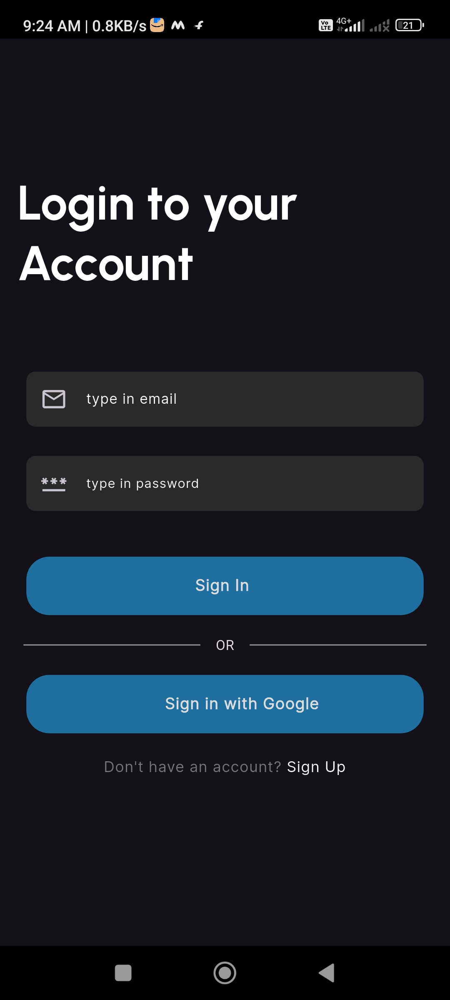
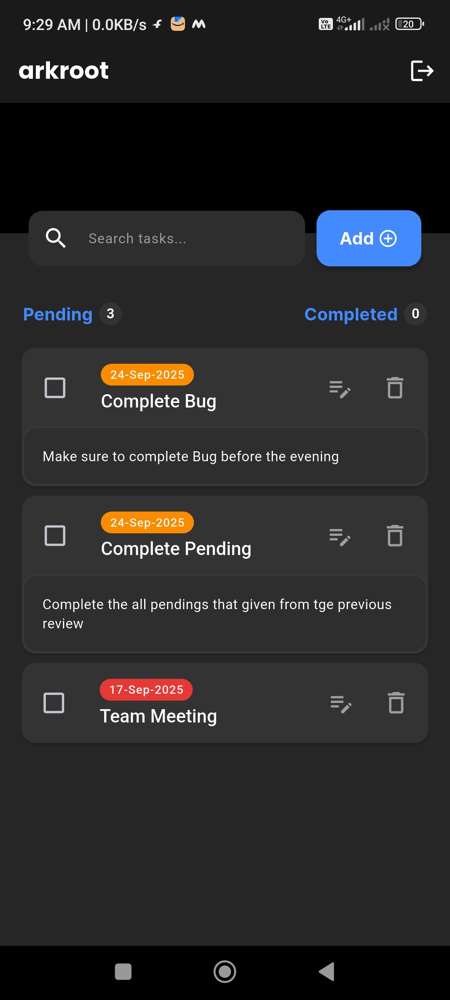
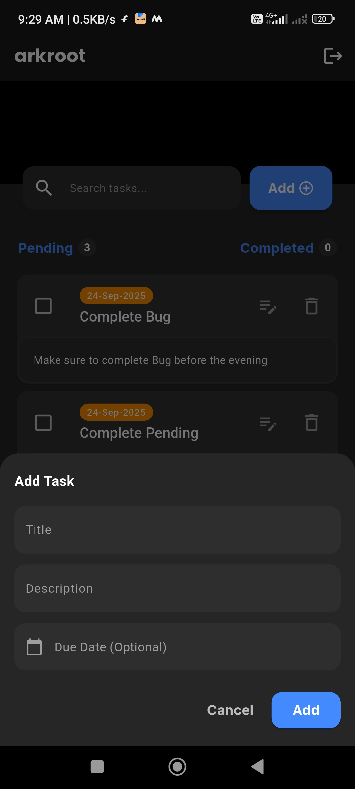

# 📝 Arkroot - To-Do App

Arkroot is a **powerful yet simple to-do app** designed to help you stay organized and focused on what truly matters.  
With its **clean interface** and **easy-to-use features**, Arkroot makes task management effortless.

---

## 🚀 Features
- ➕ **Add To-Do** – Quickly create tasks for your day.  
- ✏️ **Edit & Delete** – Update or remove tasks anytime.  
- 📅 **Prioritize with Dates** – Organize tasks by deadlines.  
- 🔔 **Reminders** – Stay on top of important tasks.  
- 🔐 **Authentication** – Secure login system.  
- 🔑 **Google Sign-In** – One-tap login with Google.  

---

## 🛠️ Tech Stack
- **Flutter** – Cross-platform UI development.  
- **Firebase** – Backend services (Authentication, Firestore, Storage).  
- **Clean Architecture** – Structured, maintainable, and scalable project design.  

---

## 📷 Screenshots

<p align="center">
  
</p>

<p align="center">
  
</p>

<p align="center">
  
</p>


---

## 📦 Installation
1. Clone the repository:
   ```bash
   git clone https://github.com/ShahirShan786/Arkroot_todo_application.git
